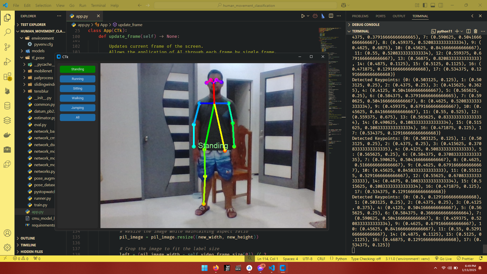
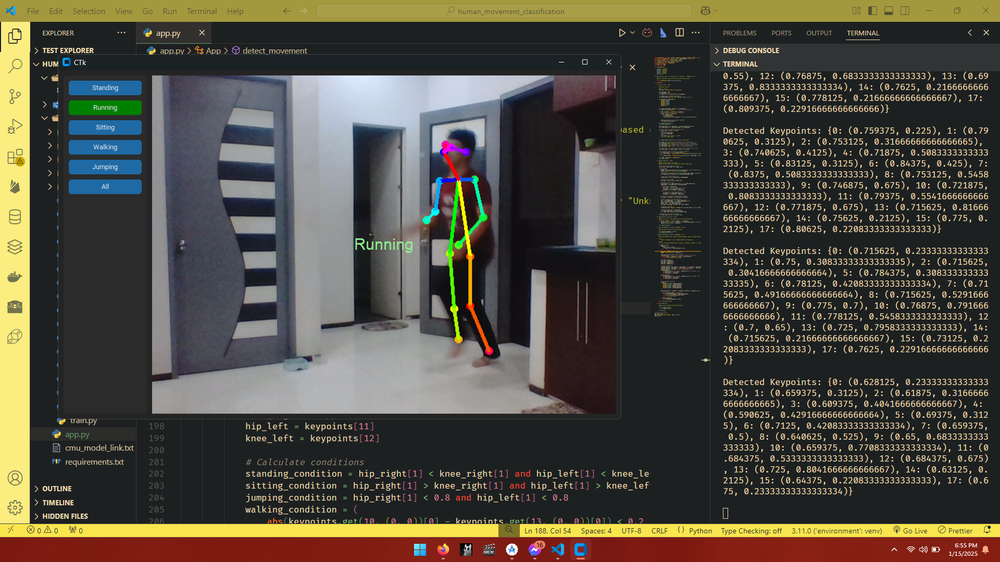
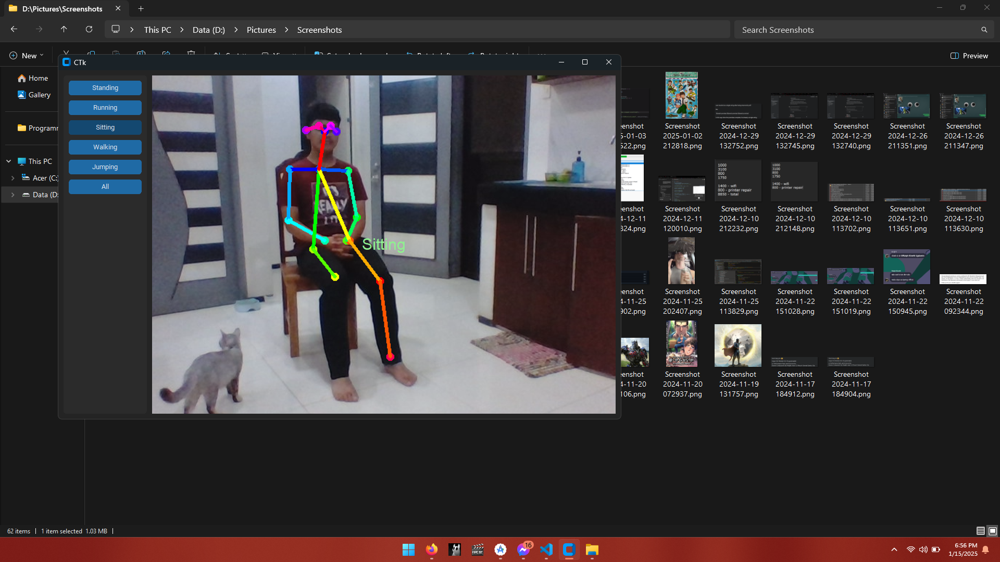
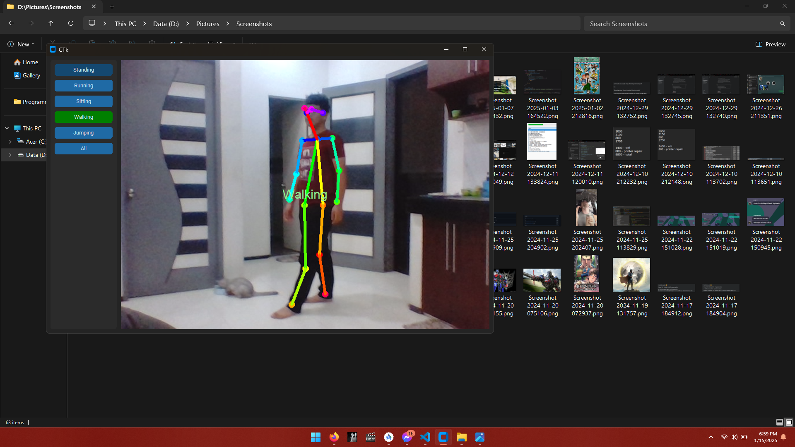
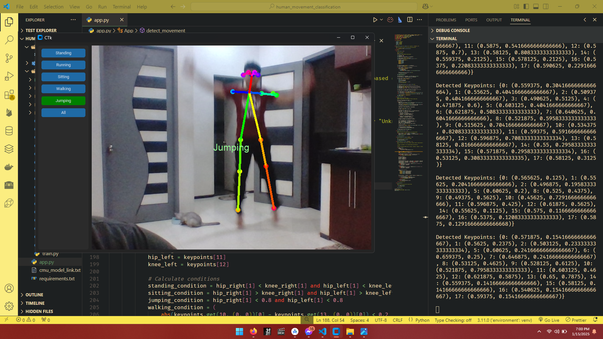

# 🧍‍♂️ AI Human Movement Classification GUI

An interactive graphical user interface (GUI) application that classifies and visualizes human movements in real-time using pose estimation. Built with [ildoonet-tf-pose-estimation](https://github.com/jiajunhua/ildoonet-tf-pose-estimation) for body joint detection and **CustomTkinter** for a modern, user-friendly interface.

This tool uses a webcam feed to display skeletal tracking (via joint pointers forming a human figure) and allows the user to select specific movement types—such as running, jumping, walking, sitting, or standing—for classification and visualization.

## ✨ Features

* 🖼️ **Real-Time Video Feed**: Live camera input with joint overlays forming a full skeletal structure.
* 🧠 **Movement Classification**: Detects and classifies common human movements.
* 🕹️ **User-Friendly GUI**: Built using CustomTkinter for a clean and responsive interface.
* 📦 **Plug-and-Play Setup**: Quick to set up with minimal configuration.
* 🔧 **Modular Design**: Easily extendable to support additional movements or custom classifiers.

## 🧰 How It Works

1. **Pose Estimation**: Utilizes `ildoonet-tf-pose-estimation` to detect and map human joints in the camera feed.
2. **Skeletal Overlay**: Draws a stick figure connecting joints to visualize posture and movement in real time.
3. **Movement Classification**: Based on joint positions and movement over time, the system identifies the current action (e.g., sitting, walking).
4. **GUI Interaction**: User selects a target movement from a dropdown menu; the system actively monitors and displays whether that movement is currently detected.

## 🛠️ Installation & Setup

### 📦 Requirements

* Python 3.11 (other versions may not be compatible)
* TensorFlow, OpenCV, and other dependencies listed in `requirements.txt`

### 🚀 Steps to Get Started

1. **Clone this repository**

   ```bash
   git clone https://github.com/AceBurgundy/movement-classification-gui.git
   cd movement-classification-gui
   ```

2. **Install dependencies**

   ```bash
   pip install -r requirements.txt
   ```

3. **Download the pose estimation model**
   Download the pre-trained TensorFlow model:

   [graph\_opt.pb](https://download2389.mediafire.com/8hilvuag1rfgT4qiE4WEMdNUoWM77tBypN4A2AdHc7hU3RTQqdfa6zzbWq6njfmWNty7ID6onSFFLkYY8PY0InAg_7Jj_xUq7ljf6oDUhwNqMWdo3uT3If42ozStz3dIPrUA7QCAg7JpcU6gZh9YcnaTeWYGjCSv3N1vAX5swgKhiH0/qlzzr20mpocnpa3/graph_opt.pb)

   Save it in the following directory:

   ```
   models/graph/cmu/
   ```

4. **Run the application**

   ```bash
   python app.py
   ```

## 🧪 Sample Outputs

> These images demonstrate the visual output of the classification system. (Note: the live system may still have minor bugs or inconsistencies that are being addressed.)

| Standing                          | Running                         | Sitting                         | Walking                         | Jumping                         |
| --------------------------------- | ------------------------------- | ------------------------------- | ------------------------------- | ------------------------------- |
|  |  |  |  |  |

## ⚠️ Troubleshooting

* **No camera feed?**
  Ensure your webcam is connected and not being used by another application.

* **GUI not launching?**
  Double-check that you are using Python 3.11 and that all dependencies are properly installed.

* **Model not found?**
  Make sure `graph_opt.pb` is correctly placed in `models/graph/cmu/`.

* **Laggy performance?**
  Try reducing the frame resolution or check if your system meets TensorFlow’s minimum requirements.

## 💡 Future Improvements

* Add support for more complex movements and postures.
* Integrate a training module to let users label and classify custom actions.
* Enhance real-time accuracy and stability under different lighting conditions.
* Add recording/export functionality for movement data.

## 📬 Contact

For bug reports, feature requests, or general questions:

* **Email**: [samadriansabalo99@gmail.com](mailto:samadriansabalo99@gmail.com)
* **GitHub**: [AceBurgundy](https://github.com/AceBurgundy)

## 📄 License

This project is for educational and research purposes. Refer to the original license in the [ildoonet-tf-pose-estimation](https://github.com/jiajunhua/ildoonet-tf-pose-estimation) repository for any third-party code.

Let me know if you’d like me to generate a project logo, usage gif, or reorganize the file structure for better documentation!
